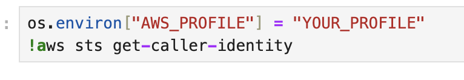

# Visual and SQL Exploration of AWS Cost and Usage Report (CUR) with Jupyter Notebooks

Rough draft, docs are sparse. But, it works! The helper functions in `./data/notebook-tools` could definitely be cleaned up, pardon the dust.

## Prerequisites

1. Docker installed; depending on size of data you import, you may want to bump up CPU and/or memory in Docker Desktop
2. Existing AWS CUR report being delivered to an S3 bucket in Parquet format
3. AWS CLI installed and configured with a profile that has ability to download from your CUR bucket (only needed if you want to use notebook to download CUR files from S3 for you)

## Quick start

1. From project root, start the Jupyter Lab container:

   `docker compose up --build`

2. In your browser, access Jupyter lab at [http://127.0.0.1:8888/](http://127.0.0.1:8888/)

3. In file explorer, open the `Explore.ipynb` notebook:

   

4. If you have already downloaded your CUR parquet files, copy them into `./data/s3` in the root dir of this project on your local host.

5. If you haven't already downloaded CUR parquet files, enter your AWS CLI profile name:

   

   Fill out the bucket name and path containing the file(s) you want to analyze:

   

6. Run the cells individually or, using the drop-down in the top menu bar, all at once.

7. The end of the notebook contains an example of querying the loaded data with SQL as well as exploring with an interactive visualization plugin.

   

   
